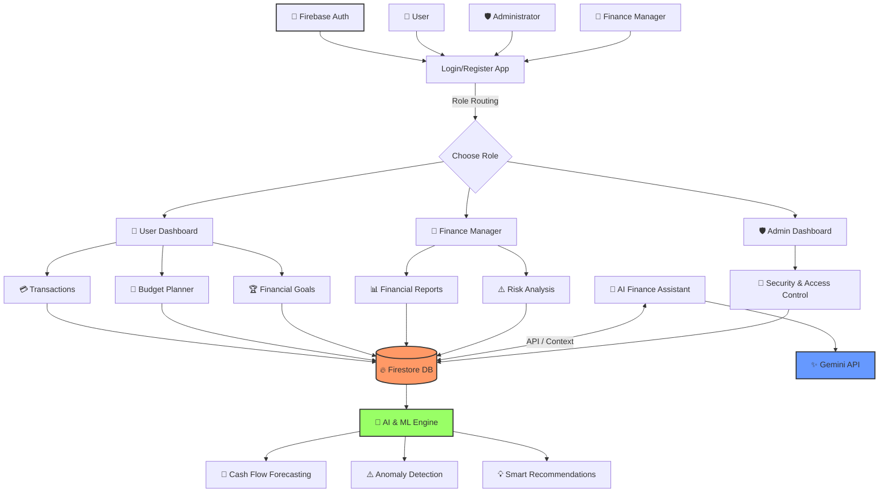

# 💰 AI Finance Controller

An intelligent financial management platform developed to help individuals, businesses, and organizations make better financial decisions using **Artificial Intelligence (AI), automated financial analysis, and real-time cash-flow monitoring**. AI Finance Controller is designed to simplify financial management by combining budgeting, expense tracking, cash-flow forecasting, financial risk analysis, and AI-powered recommendations into a single digital platform.

The platform addresses common financial challenges such as **poor expense management, unpredictable cash flow, inefficient budgeting, financial risks, and lack of personalized financial guidance**. By using AI-driven insights and automated analysis, AI Finance Controller helps users understand their financial position, identify potential risks, and make smarter decisions.

---

## 🚀 Featured Modules

AI Finance Controller integrates multiple technology-enabled modules into an accessible and user-friendly financial dashboard:

* **🤖 AI Financial Assistant** – An intelligent AI-powered assistant that analyzes financial data and provides personalized answers, recommendations, budgeting suggestions, and financial insights.

* **📊 Financial Dashboard** – Provides a centralized view of income, expenses, savings, budgets, transactions, and overall financial performance through interactive charts and visualizations.

* **💸 Expense & Income Management** – Allows users to record, categorize, and monitor their income and expenses. Automated categorization helps users understand where their money is being spent.

* **📈 Cash Flow Controller** – Monitors incoming and outgoing transactions and provides an overview of the user's current and expected cash flow.

* **🔮 AI Cash Flow Forecasting** – Uses historical transaction data to predict future income, expenses, and potential cash-flow shortages, helping users prepare for upcoming financial requirements.

* **⚠️ Financial Risk Detection** – Identifies unusual spending patterns, excessive expenses, budget violations, and other potential financial risks and provides early warnings.

* **🎯 Smart Budget Planner** – Helps users create monthly or customized budgets based on their income, spending patterns, financial goals, and previous transactions.

* **🏦 Financial Goals Management** – Allows users to create and track financial goals such as emergency funds, education, business investments, savings, and major purchases.

* **📑 AI Financial Reports** – Generates simplified financial summaries and reports containing spending patterns, budget performance, savings progress, and risk indicators.

* **🔐 Role-Based Access Control** – Provides different access levels for administrators, financial managers, and users to protect financial information and maintain controlled access.

---

## 🛠️ Technical System

The platform has been developed using a **multi-layer architecture** to support scalability, security, and modular development. The architecture consists of three primary layers: **presentation, application, and database layers**.

* **Front-End Web Dashboard:** React.js – A responsive and user-friendly web interface that provides dashboards and financial management features for users, financial managers, and administrators.

* **Back-End Server:** Java / RESTful Services – The backend manages business logic, authentication, financial calculations, transaction processing, API communication, role-based access control, and communication between different modules.

* **AI & Analytics Layer:** Python / Machine Learning / Gemini API – AI and machine learning technologies are used for financial analysis, forecasting, anomaly detection, intelligent recommendations, and conversational assistance.

* **Database Engine:** Firebase Firestore – Stores user profiles, financial transactions, budgets, financial goals, reports, risk alerts, and other application data.

* **Authentication:** Firebase Authentication – Provides secure user registration, login, identity verification, and session management.

---

## 🏗️ Core Architecture Flow



---

## 📊 System's Methodology & Implementation

### 1. User Verification & Authentication

Users can create accounts through a secure web-based registration and authentication system. Firebase Authentication is used to manage user identity, login sessions, and controlled access to financial information.

The platform supports **role-based authentication**, allowing users, finance managers, and administrators to access only the features permitted for their respective roles.

---

### 2. Financial Transaction Management

Users can record their income and expenses through the financial dashboard. Each transaction can be categorized based on parameters such as:

* Food and groceries
* Transportation
* Education
* Healthcare
* Shopping
* Bills and utilities
* Business expenses
* Investments
* Salary and other income

The transaction records are stored in Firestore and are used by the analytics engine to generate financial insights.

---

### 3. Smart Budget Management

The Budget Controller analyzes historical spending and income information to help users create practical budgets.

The system can monitor:

**Income → Planned Budget → Actual Spending → Remaining Budget → Financial Status**

If the user's spending approaches or exceeds a predefined budget limit, the system can generate an alert.

---

### 4. AI-Based Financial Analysis

The AI engine analyzes financial records to identify spending patterns and provide personalized recommendations.

For example, the system can identify:

* Increasing monthly expenses
* Unnecessary recurring expenses
* Overspending in specific categories
* Low savings rates
* Unusual transactions
* Potential cash-flow shortages

The AI then converts these observations into simple recommendations that users can understand.

---

### 5. Cash Flow Forecasting

Historical financial data can be analyzed to estimate future cash flow.

The forecasting pipeline follows:

```text
Transaction Data
       ↓
Data Cleaning & Processing
       ↓
Historical Financial Analysis
       ↓
AI / ML Forecasting Model
       ↓
Future Income & Expense Prediction
       ↓
Cash Flow Risk Analysis
       ↓
Financial Recommendation
```

This helps users identify possible financial shortages before they occur.

---

### 6. Financial Risk Detection

The Risk Management module continuously analyzes financial activity and generates alerts when potentially risky patterns are detected.

Examples include:

* ⚠️ Excessive spending
* ⚠️ Repeated budget violations
* ⚠️ Sudden increase in expenses
* ⚠️ Unusual transaction behavior
* ⚠️ Negative cash-flow prediction
* ⚠️ Low emergency savings
* ⚠️ High financial dependency on a single income source

The objective is to provide **early financial warnings rather than reacting after a financial problem occurs**.

---

### 7. AI Finance Assistant

The AI Finance Assistant acts as a 24/7 virtual financial controller.

Users can ask questions such as:

* "Where did I spend the most money this month?"
* "How much can I save this month?"
* "Am I exceeding my budget?"
* "What are my highest expenses?"
* "How much should I save for my goal?"
* "Will I have enough cash next month?"

The assistant uses the user's authorized financial context to provide relevant responses.

---

### 8. Financial Reports & Analytics

The system converts financial data into easy-to-understand reports and dashboards.

Reports may include:

* Monthly income and expense reports
* Category-wise spending analysis
* Budget performance
* Savings analysis
* Cash-flow reports
* Financial risk reports
* Goal progress
* AI-generated financial summaries

Interactive charts and visualizations make complex financial information easier to understand.

---

## 🔐 Security & Compliance

Since the platform works with sensitive financial information, security is a major part of the system design.

The platform can implement:

* 🔐 Firebase Authentication
* 👥 Role-Based Access Control (RBAC)
* 🔒 Secure API communication
* 🛡️ Firestore Security Rules
* 🔑 Protected environment variables
* 📋 Audit logs
* 🔍 Transaction monitoring
* 🚫 Unauthorized access prevention

The system is designed with privacy and responsible handling of financial data in mind, with scope for alignment with applicable Indian data-protection and information-technology requirements.

---

## 🧩 Proposed Database Structure

```text
Users
 ├── userId
 ├── name
 ├── email
 ├── role
 └── createdAt

Transactions
 ├── transactionId
 ├── userId
 ├── type
 ├── category
 ├── amount
 ├── description
 └── timestamp

Budgets
 ├── budgetId
 ├── userId
 ├── category
 ├── limit
 ├── spent
 └── period

FinancialGoals
 ├── goalId
 ├── userId
 ├── goalName
 ├── targetAmount
 ├── currentAmount
 └── deadline

RiskAlerts
 ├── alertId
 ├── userId
 ├── riskType
 ├── severity
 ├── description
 └── timestamp

AIInsights
 ├── insightId
 ├── userId
 ├── insightType
 ├── recommendation
 └── createdAt
```

---

## 🔄 Complete System Workflow

```text
User
  ↓
Authentication
  ↓
Role-Based Dashboard
  ↓
Financial Data Collection
  ↓
Transaction & Budget Processing
  ↓
Firestore Database
  ↓
AI / ML Analytics
  ↓
 ┌─────────────────────────────┐
 │ Cash Flow Forecasting        │
 │ Expense Analysis             │
 │ Risk Detection               │
 │ Budget Recommendations       │
 │ Financial Insights           │
 └─────────────────────────────┘
  ↓
AI Finance Controller
  ↓
Reports + Alerts + Recommendations
  ↓
Better Financial Decisions
```

---

## 🔮 Future Scope

Future versions of AI Finance Controller can be expanded with advanced financial technologies and intelligent automation:

* **📱 Mobile Application** – Android and iOS applications for real-time financial monitoring.

* **🏦 Open Banking Integration** – Secure integration with supported financial institutions to automatically retrieve transaction information where legally and technically available.

* **🤖 Advanced AI Financial Planning** – AI-based personalized financial planning based on long-term income, expenses, goals, and risk preferences.

* **📈 Advanced Predictive Analytics** – More accurate forecasting of income, expenses, savings, and cash-flow requirements using advanced machine-learning models.

* **🔍 Fraud & Anomaly Detection** – Advanced machine-learning models for identifying potentially fraudulent or abnormal transactions.

* **💳 Automated Expense Categorization** – Automatically classify transactions using machine-learning models.

* **🔗 Blockchain-Based Financial Ledger** – Explore blockchain technology for tamper-resistant transaction records and transparent financial auditing.

* **🎙️ Multilingual Voice Assistant** – A voice-based financial assistant supporting regional Indian languages to improve accessibility.

* **📊 Business Finance Controller** – Expand the system for small businesses and startups with payroll, invoices, vendor management, profit/loss analysis, and business cash-flow forecasting.

* **☁️ Cloud-Based Microservices** – Convert the platform into a scalable microservices architecture for enterprise-level deployment.

---

## 🎯 Key Objectives

The primary objectives of AI Finance Controller are:

1. **Simplify financial management** through an easy-to-use digital platform.
2. **Improve financial awareness** by presenting income and expenses clearly.
3. **Predict future cash flow** using AI and historical financial data.
4. **Identify financial risks early** before they become serious problems.
5. **Provide personalized recommendations** using AI.
6. **Improve budgeting and savings discipline**.
7. **Protect sensitive financial information** through authentication and access control.
8. **Support data-driven financial decision-making** for individuals and organizations.

---

## 💻 Research and Innovation

AI Finance Controller combines **Artificial Intelligence, Machine Learning, Financial Analytics, Cloud Computing, and Secure Web Technologies** to create an intelligent financial management ecosystem.

The project focuses on transforming traditional financial tracking from a **reactive system** into a **proactive AI-powered financial controller**.

Instead of simply showing users what happened to their money, the system aims to answer three important questions:

> **What happened?**
> **What is likely to happen?**
> **What should I do next?**

This approach makes AI Finance Controller more than a conventional expense tracker and positions it as an intelligent decision-support platform.

---

## 👨‍💻 Contributors

**Mrs. Sanika Hanmant Pawar **
Computer Engineering Department
D. Y. Patil School of Engineering & Management, Kolhapur
---


